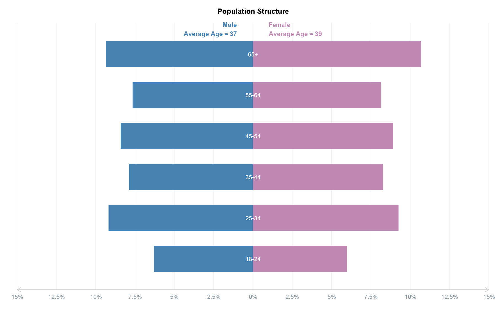
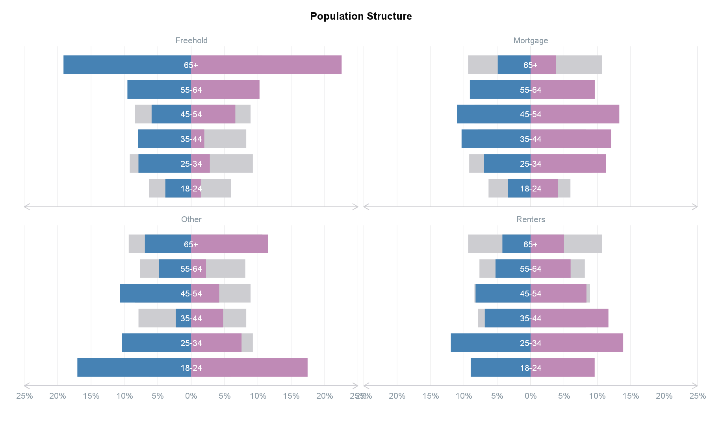
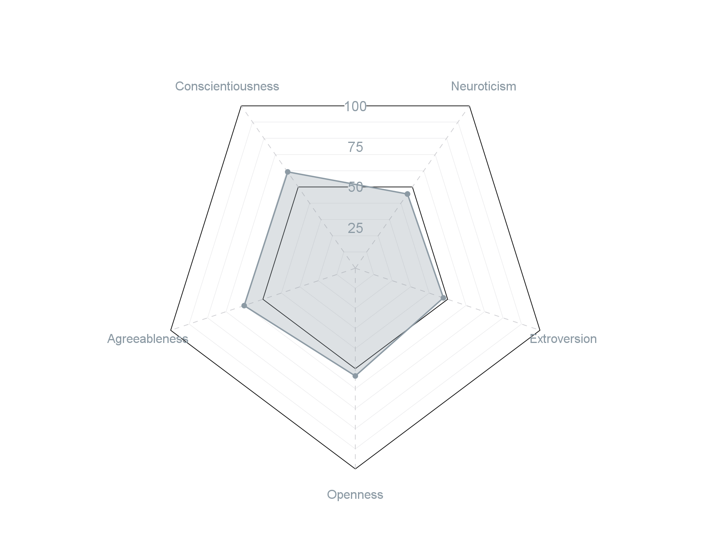
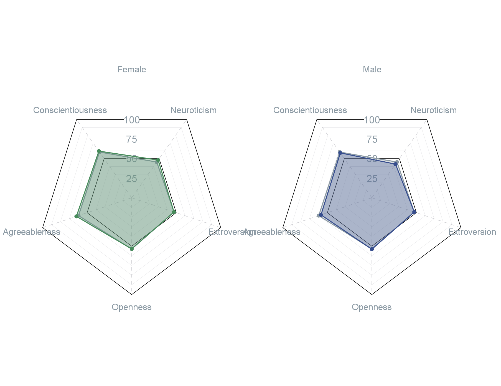

```{r, include = FALSE}
knitr::opts_chunk$set(
  collapse = TRUE,
  comment = "#>",
  eval = FALSE
)
```
### Population Plot

The `plot_popn` function returns a [ggplot2](https://ggplot2.tidyverse.org/reference/theme.html) chart to help visualise the population structure of the survey data. The population pyramid is provided as a percentage and can return the average age of Male vs Female data if the actual age numbers were collected within the survey.

```{r plot_popn1}
# Create plot using age groups and age intervals included to return average age
plot_popn(dataset,
          age_group = "age_categories",
          gender = "gender",
          weight = "wgtvar",
          age_int = "age")
```
```{r img/popn_plot1, echo=FALSE, eval = TRUE, out.width = '100%'}

```
<br>

A group comparator option will be added in the future to provide a way to visually compare groups against the average.

```{r plot_popn2}
plot_popn(dataset,
          age_group = "age_categories",
          gender = "gender",
          weight = "wgtvar",
          group = "housing_categories")
```
```{r img/popn_plot2, echo=FALSE, eval = TRUE, out.width = '100%'}

```
<br>

### Personality Plot

The `plot_bigfive` function returns a [ggplot2](https://ggplot2.tidyverse.org/reference/theme.html) chart to help visualise the personality profile of the survey data. This radar chart is primarily to visualise the Big Five personality traits (neuroticism, extroversion, openness, agreeableness, and conscientiousness) but can be amended for other quantitative data types with a scale between 0 and 100.

When a group is provided, the function returns faceted plots with the variables within the group plotted on top of the average. This provides an easy comparison between the variable and the rest of the cohort in the survey.

```{r plot_bigfive1}
# Create single plot using unweighted data
plot_bigfive(dataset,
             big_five = c("Neuroticism", "Extroversion", "Openness", "Agreeableness", "Conscientiousness"))
```
```{r img/bigfive_plot1, echo=FALSE, eval = TRUE, out.width = '100%'}

```

```{r plot_bigfive2}
# Create faceted plot using age groups and weighted data
plot_bigfive(dataset,
             big_five = c("Neuroticism", "Extroversion", "Openness", "Agreeableness", "Conscientiousness"),
             group = "Gender",
             weight = "wgtvar")
```
```{r img/bigfive_plot2, echo=FALSE, eval = TRUE, out.width = '100%'}

```
<br>

### Binary Plot

The `plot_binary` function returns a [ggplot2](https://ggplot2.tidyverse.org/reference/theme.html) chart to help visualise binary grid-based questions (e.g., "Yes" vs "No"). See `grid_vars` for more information.

```{r plot_binary}
# Create list
# vars <- list(Q1a = "Art",
#              Q1b = "Automobiles",
#              Q1c = "Birdwatching"
#              ...)
# Create plot
plot_binary(dataset,
            vars = vars,
            group = "gender",
            weight = "wgtvar",
            return_var = "Yes")
```
```{r img/binary_plot, echo=FALSE, eval = TRUE, out.width = '100%'}
knitr::include_graphics("img/binary_plot.png")
```
<br>

### Sankey Plot

The `plot_sankey` function returns a [d3.js](https://d3js.org/) sankey chart to help visualise the flow of data.

```{r plot_sankey}
# Libraries
library(tidyverse)

# =====================================#
# Upload split voting data
df <- scgElectionsNZ::get_data("split_total")

# Prepare Sankey Data
df <- df %>%
  filter(Year==2023) %>% # get 2023 election data only
  # combine unsuccessful minor parties into "Other" category
  mutate(List_Party = ifelse(
    List_Party %in% c("Labour Party","ACT Party","Maori Party","Green Party","National Party","NZ First","Informal"),
    List_Party, "Other"
  )) %>%
  mutate(Electorate_Party = ifelse(
    Electorate_Party %in%
      c("Labour Party","ACT Party","Maori Party","Green Party","National Party","NZ First","Informal"),
    Electorate_Party, "Other"
  )) %>%
  group_by(List_Party, Electorate_Party) %>%
  summarise(Vote = sum(Votes)) %>%
  ungroup()

# A tibble: 64 x 3
#   List_Party  Electorate_Party    Vote
#   <chr>       <chr>              <dbl>
# 1 ACT Party   ACT Party         68692.
# 2 ACT Party   Green Party        2095.
# ...

# =====================================#
# Look up colours
colour_pal("polNZ")
# $`ACT Party`
# [1] "#ffd006"
# $`Green Party`
# [1] "#45ba52"
# ...

# Create Sankey
plot_sankey(
  data = df,
  source = "Electorate_Party", # left side of sankey
  target = "List_Party", # right side of sankey
  value = "Vote",
  colours = '"#ffd006","#45ba52","#d5cdb9","#D82A20","#B2001A","#000000","#00529F","#cdcdd1"',
  fontSize = 20, # reduce font size from default
  width = 1600 # increase width form default
) %>%
  # save from viewer to html
  htmlwidgets::saveWidget(file="sankey_2023.html", selfcontained = TRUE)
```
```{r img/sankey_plot, echo=FALSE, eval = TRUE, out.width = '100%'}
knitr::include_graphics("img/sankey_plot.png")
```