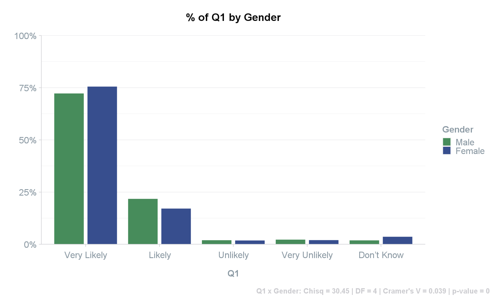

```{r, include = FALSE}
knitr::opts_chunk$set(
  collapse = TRUE,
  comment = "#>",
  eval = FALSE
)
```
A large part of exploring survey data involves creating crosstabs / contingency tables. The following provides available functions to help with these processes.

### Individual Variables
The `crosstab` function produces a 2x2 table in either a long or wide data frame format. The long format is useful for further analysis or for use in plots. The wide format is also useful for further analysis or for easily viewing individual results.
```{r crosstab1}
# GET CROSSTABS FOR TWO VARIABLES
# Long format crosstab with % data and no totals included.
df <- crosstab(dataset,
               row_var = "Q1",
               col_var = "Gender",
               weight = "wgtvar",
               totals = FALSE, # turn off totals (DEFAULT = TRUE)
               round_decimal=2) # set number of decimal points for values

# [1] Q1 x Gender: Chisq = 30.45 | DF = 4 | Cramer's V = 0.039 | p-value = 0
#               Q1 Gender    Freq  Perc
# 1    Very Likely Female 1971.54 75.52
# 2         Likely Female  446.31 17.10
# 3       Unlikely Female   47.22  1.81
# 4  Very Unlikely Female   51.72  1.98
# 5     Don’t Know Female   93.88  3.60
# 6    Very Likely   Male 1793.60 72.23
# 7         Likely   Male  540.24 21.75
# 8       Unlikely   Male   48.21  1.94
# 9  Very Unlikely   Male   54.98  2.21
# 10    Don’t Know   Male   46.30  1.86
```
```{r crosstab_plot, echo=FALSE, eval = TRUE, out.width = '100%'}

```

```{r crosstab2}
# Wide format crosstab without weight variable and retained frequency data.
df <- crosstab(dataset,
               row_var = "Q1",
               col_var = "Gender",
               round_decimal=2,
               statistics = FALSE, # turn off statistics (DEFAULT = TRUE)
               plot = FALSE, # turn off plot (DEFAULT = TRUE)
               format = "df_wide", # (DEFAULT = "df_long")
               convert_to = "frequency") # (DEFAULT = "percent")

# A tibble: 5 x 4
#   Q1            Total Female  Male
#   <fct>         <dbl>  <dbl> <dbl>
# 1 Very Likely    4009   2319  1690
# 2 Likely          854    436   418
# 3 Unlikely         75     37    38
# 4 Very Unlikely    68     35    33
# 5 Don’t Know       88     70    18
```
<br>

### Multiple Variables
The `compile` function iterates through all the available variable and grouping options that you want in order to provide a full set of crosstabs. Each crosstab contains a statistic to understand the association between the two variables.

*NB caution using chi-square and p-values when the sample size is >500 or <5. In these circumstances, use Cramer's V or Fisher's Exact test, respectively.*

Once the function has run, the data is saved to a csv in your project directory unless stated otherwise.
```{r compile}
# GET CROSSTABS FOR ALL VARIABLES
compile(dataset,
        row_vars = c("Q1", "Q2"),
        col_vars = c("Gender", "VI"),
        weight = "wgtvar",
        name = "crosstabs") # set name to save .csv as (DEFAULT = "table")

#                             Gender        VI
# Q1                   Total  Male  Female  Gov.  I would not vote  Not enrolled  Opp.  Other
#          Very likely   62%   67%     57%   73%                0%            9%   76%    39%
#      Somewhat likely   18%   15%     22%   19%                3%            5%   19%    34%
#      Not very likely    5%    4%      7%    5%               19%            0%    3%     7%
#    Not at all likely    6%    8%      6%    0%               55%           13%    0%     3%
#               Unsure    8%    6%      9%    3%               23%           73%    2%    17%
# Weighted sample size   991   480     511   347                90            26    419   109
# V6 x Gender: Chisq = 21.382 | DF = 4 | Cramer's V = 0.073 | p-value = 0.000
# V6 x VI: Chisq = 772.347 | DF = 16 | Cramer's V = 0.441 | p-value = 0.000
#
#                             Gender        VI
# Q2                   Total  Male  Female  Gov.  I would not vote  Not enrolled  Opp.  Other
# ...

```

The `compile` function can also iterate through all the available variable and grouping options to provide a list of statistics. In either formatting options, there is an option of not saving the data frame to a csv and to instead return the data frame within your R environment.

```{r statistics}
# GET STATISTICS
compile(dataset,
        row_vars = c("Q1", "Q2"),
        col_vars = c("Gender", "Edu", "VI"),
        weight = "wgtvar",
        format = "statistics", # set format to "statistics" (DEFAULT = "csv")
        save=FALSE) # set to FALSE if you do not want to save to a .csv (DEFAULT = TRUE)

#   Row_Var Col_Var Size    Chisq DF CramersV p_value
# 1      Q1  Gender  991   23.757  4    0.077   0.000
# 2      Q1     Edu  991   44.034 20    0.105   0.001
# 3      Q1      VI  991  694.206 16    0.418   0.000
# 4      Q2  Gender  991   64.520 16    0.064   0.000
# 5      Q2     Edu  991  170.355 80    0.104   0.000
# 6      Q2      VI  991 2458.172 64    0.394   0.000
```