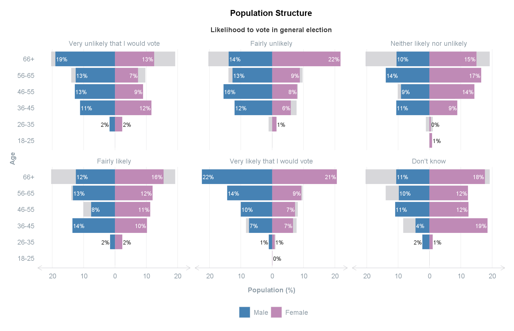
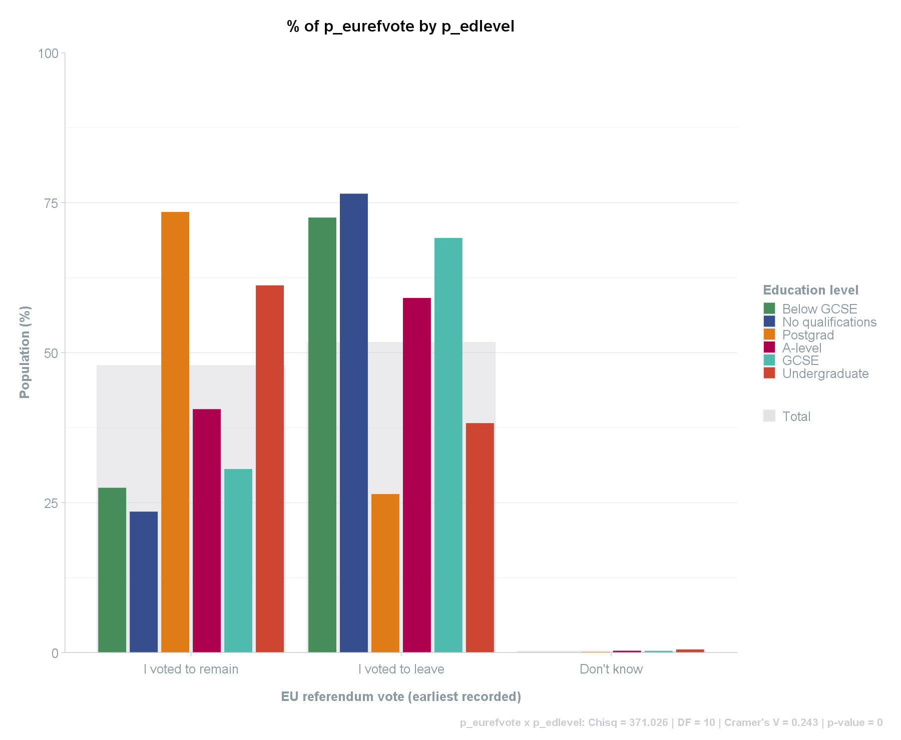
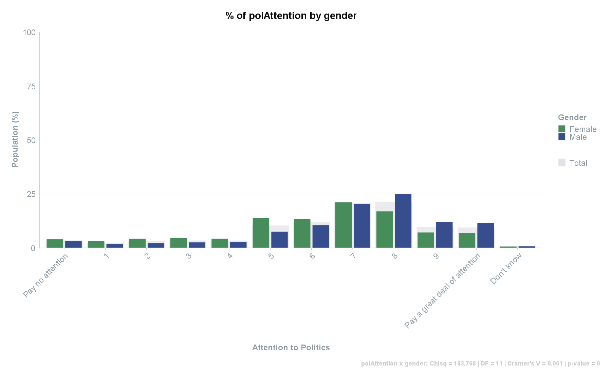
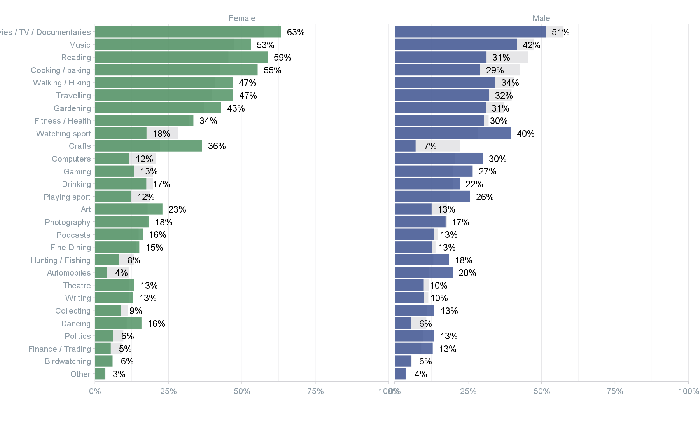

```{r, include = FALSE}
knitr::opts_chunk$set(
  collapse = TRUE,
  comment = "#>",
  eval = TRUE
)
```

This article aims to guide you through the process of uploading, processing, and exploring survey data.

```{r setup, include = FALSE}
library(scgUtils)
```
<br>

### Step 1: Upload
##### **Using data from packages**

If you are using the sample dataset within this package, use the following `get_data` function to access and save it as a data frame.
```{r upload_data}
df <- get_data("survey")
```
*Note on the sample data: the data only contains a small portion of full survey data from the British Electoral Survey. This article does not analyse the full survey data and is only used as an example for how to use the functions within the `scgUtils` package. The full survey data can be found here: https://www.britishelectionstudy.com/data-object/wave-25-of-the-2014-2023-british-election-study-internet-panel/*

<br>

##### **Using other data**

Alternatively, if you are uploading your own data, you can use the [`haven`](https://haven.tidyverse.org/) package to read an SPSS file in R.

```{r upload_data_alternative, eval = FALSE}
df <- haven::read_sav("your_survey_data.sav")
```

*Troubleshooting `read_sav()`:*

NB if an error occurs which relates to encoding, try adding `encoding="latin1"`. Once you have uploaded the data, view which string is causing the error. This may have been caused by `NAs` which will require you to convert them from a string to `NA`. For example:
```{r upload_data_troubleshooting, eval = FALSE}
df <- haven::read_sav("your_survey_data.sav", encoding = "latin1")

# Additional step to amend error across entire dataset (all columns)
df[df == "__NA__"] <- NA
```
<br>

### Step 2: View
View the first 6 rows of the data file and the details of each column
```{r view_data2, eval = FALSE}
# NB first 3 variables shown only
head(df[, 1:3])
# A tibble: 6 x 3
#      id    wt turnoutUKGeneral
#   <dbl> <dbl> <dbl+lbl>
# 1     7 0.376 5 [Very likely that I would vote]
# 2    14 0.553 5 [Very likely that I would vote]
# 3    15 0.712 5 [Very likely that I would vote]
# 4    18 0.440 4 [Fairly likely]
# 5    19 0.361 5 [Very likely that I would vote]
# 6    24 1.69  5 [Very likely that I would vote]
```
<br>

You can also view the original questionnaire and values easily by using the [`view_df`](http://www.strengejacke.de/sjPlot/reference/view_df.html) from the `sjPlot` package.
```{r view_data1, eval = FALSE}
# NB first 10 variables shown only
sjPlot::view_df(df[, 1:10])
```
````{=html}
<iframe width="100%" height="850"
  src="img/questionnaire.html"
  frameborder="0"
  allowfullscreen></iframe>
````
<br>

### Step 3: Clean
##### **Converting labelled data into factors**

To add remove the labels from the variables and convert them into factors, use the [`labelled`](https://larmarange.github.io/labelled/) package.
```{r clean_data1}
df <- labelled::unlabelled(df)
```
```{r clean_data2, eval = FALSE}
# NB first 3 variables shown only
head(df[, 1:3])
# A tibble: 6 x 3
#      id    wt turnoutUKGeneral
#   <dbl> <dbl> <fct>
# 1     7 0.376 Very likely that I would vote
# 2    14 0.553 Very likely that I would vote
# 3    15 0.712 Very likely that I would vote
# 4    18 0.440 Fairly likely
# 5    19 0.361 Very likely that I would vote
# 6    24 1.69  Very likely that I would vote
```
<br>

##### **Removing unused factor levels**

Sometimes there will be circumstances where you have unused factor levels, such as "Under 18" (often occurs in surveys which disqualifies certain respondents from participating).
```{r clean_data3}
levels(df$ageGroup)
```

To remove all unused factor levels across the dataset, you can use the `remove_levels` function.
```{r clean_data4}
df <- process_factors(df)
```

Using this function will ensure that the metadata is retained and can still be accessed.
```{r clean_data5}
# "Under 18" has not been removed:
levels(df$ageGroup)

# The metadata containing the question/label for this column remains:
attr(df$ageGroup, "label")
```
<br>

### Step 4: Weighting
*Section and functions to be added in the future (for survey data without a weighting variable)*

<br>

### Step 5: Explore
##### **Numeric data**
To explore numeric data, descriptive statistics can easily be found using `summary` and a combination of `tapply` and `summary` for statistics by group. These are for unweighted data only, however.
```{r numeric1}
summary(df$age)

# By group:
tapply(df$age, df$gender, summary)
```
<br>

To find the average of numeric data, use the `mean` or `weighted.mean` functions from the `stats` package (base R).
```{r numeric2}
# Unweighted:
mean(df$age)

# Weighted:
weighted.mean(df$age, df$wt)
```
<br>

To find weighted or unweighted averages by one or many group variables, use the `grp_mean` function.
```{r numeric3}
# By a single group:
grp_mean(df,
         meanVar = "age",
         groups = "gender",
         weight = "wt" # optional
)

# By many groups:
grp_mean(df,
         meanVar = "age",
         groups = c("gender", "partyId"),
         weight = "wt", # optional
         set_names = c("Gender", "Party Identification", "Average Age"), # change names
         round_decimals = 2 # round decimal places to 2 digits
)

# NB. The `dplyr` equivalent is:
# df %>%
#   group_by(gender, partyId) %>%
#   summarise(Mean = weighted.mean(age, wt))
```
<br>

##### **Categorical data**
For categorical data, use the `crosstab` function and set `statistics = TRUE` to include statistics for each crosstab.
```{r categorical1, eval = FALSE}
crosstab(df,
         rowVar = "partyId",
         colVar = "gender",
         weight = "wt", # optional
         format = "df_wide",
         round_decimals = 2,
         statistics = TRUE
)
# [1] partyId x gender: Chisq = 29.054 | DF = 9 | Cramer's V = 0.028 | p-value = 0.001
#                          partyId Total Female  Male
# 1                   Conservative 29.26  27.41 30.85
# 2                         Labour 24.14  25.38 23.09
# 3               Liberal Democrat  5.84   5.64  6.00
# 4  Scottish National Party (SNP)  2.55   2.89  2.26
# 5                    Plaid Cymru  0.37   0.32  0.41
# 6                    Green Party  2.52   2.17  2.81
# 7                          Other  1.36   1.05  1.63
# 8                      No - none 27.35  27.93 26.85
# 9         Brexit Party/Reform UK  2.50   1.91  3.00
# 10                    Don't know  4.12   5.31  3.10
```
<br>

To see the data presented as a frequency instead of a percentage, without totals, and in a longer format, input the following into the `crosstab` function:
```{r categorical2, eval = FALSE}
crosstab(df,
         rowVar = "partyId",
         colVar = "gender",
         weight = "wt", # optional
         format = "df_long", # default option
         round_decimals = 2,
         totals = FALSE,
         convert_to = "frequency"
)
#                          partyId gender   Freq
# 1                   Conservative   Male 663.95
# 2                         Labour   Male 496.94
# 3               Liberal Democrat   Male 129.14
# 4  Scottish National Party (SNP)   Male  48.73
# 5                    Plaid Cymru   Male   8.81
# 6                    Green Party   Male  60.48
# 7                          Other   Male  35.09
# 8                      No - none   Male 577.89
# 9         Brexit Party/Reform UK   Male  64.56
# 10                    Don't know   Male  66.73
# ...
```
<br>

To automate the above across all variables, the `compile` function can first create a data frame of all statistics (Chi-square, Degrees of Freedom, Cramer's V, and p-value).
```{r categorical3, eval = FALSE}
# the row variables are typically your questions within the survey. For ease, utilise dplyr to select the variables
rowVars <- names(df %>% dplyr::select(turnoutUKGeneral:partyIdStrength,
                                      partyIdSqueeze:likeGrn,
                                      pcon:p_hh_size,
                                      p_disability:p_past_vote_2019,
                                      p_eurefturnout))

# the column variables tend to be the demographic variables
colVars <- c("gender", "ageGroup", "p_socgrade", "partyId", "p_eurefvote", "p_edlevel")

# compile stats and save to data frame called `stats`
stats <- compile(df,
                 rowVars = rowVars,
                 colVars = colVars,
                 weight = "wt", # optional
                 save = FALSE, # turn this to FALSE to prevent saving as a .csv
                 format = "statistics")

# View first 10, sorted by Cramer's V
head(stats[order(-stats$CramersV),], 10)
#                 Row_Var   Col_Var     Size     Chisq DF CramersV p_value
# 10  generalElectionVote   partyId 3953.314 10049.807 81    0.531       0
# 316    p_past_vote_2017   partyId 3545.672  5251.916 72    0.430       0
# 52            bestOnMII   partyId 3719.803  5886.195 81    0.419       0
# 310    p_past_vote_2015   partyId 3567.690  5054.699 81    0.397       0
# 258     p_education_age p_edlevel 3465.861  3157.122 30    0.390       0
# 322    p_past_vote_2019   partyId 3551.306  4736.332 90    0.365       0
# 248        p_job_sector  ageGroup 3991.109  1706.840 20    0.327       0
# 200         p_work_stat  ageGroup 3991.109  2857.155 35    0.320       0
# 298    p_past_vote_2010   partyId 3511.013  3182.663 81    0.317       0
# 304    p_past_vote_2005   partyId 3222.173  2868.127 81    0.314       0
```
<br>

Using the same `colVars` and `rowVars` as above, the `compile` function can also be used to iterate through each variable and produce tables, saved into a csv. Once in the csv, the tables can be formatted.
```{r categorical4, eval = FALSE}
compile(df,
        rowVars = rowVars,
        colVars = colVars,
        weight = "wt", # optional
        name = "crosstabs" # this will save as "crosstabs.csv"
)
```
```{r crosstab_csv, echo=FALSE, out.width = '100%'}
knitr::include_graphics("img/crosstab_csv.png")
```
<br>
<br>

##### **Grid data**
In surveys, there are often *"Please select all that apply"* type questions or a grid formation for the question (e.g., *Do you have a favourable or unfavourable impression of the following political leaders?"*). In these circumstances, the results for the question is separated out into many columns, making it difficult to compare.

To resolve this, use the `grid_vars` function. This function provides the Question (the named list), the Response, and the frequency and percent. The result is provided in a long format so it can easily be used in [`ggplot2`](https://ggplot2.tidyverse.org/) for visualisation.
```{r grid1, eval = FALSE}
# Create a named list of the columns that relate to the question
vars <- list(likeSunak = "Rishi Sunak",
             likeStarmer = "Keir Starmer",
             likeCon = "Conservative Party",
             likeLab = "Labour Party",
             likeLD = "Lib Dems",
             likeSNP = "SNP",
             likePC = "Plaid Cymru",
             likeBrexitParty = "Brexit Party",
             likeGrn = "Green Party"
)

grid_vars(df,
          vars = vars,
          weight = "wt" # optional
)
#               Question         Response    Freq  Perc
# 1         Brexit Party Strongly dislike 1369.44 34.31
# 2   Conservative Party Strongly dislike 1260.06 31.57
# 3          Green Party Strongly dislike  810.10 20.30
# 4         Keir Starmer Strongly dislike  850.59 21.31
# 5         Labour Party Strongly dislike  839.85 21.04
# 6             Lib Dems Strongly dislike  776.15 19.45
# 7          Plaid Cymru Strongly dislike   83.67 28.25
# 8          Rishi Sunak Strongly dislike  776.61 19.46
# 9                  SNP Strongly dislike  181.45 38.11
# 10        Brexit Party                1  208.83  5.23
# ...
```
<br>

This `grid_vars` function can also be used with a `group` variable.
```{r grid2, eval = FALSE}
grid_vars(df,
          vars = vars,
          group = "gender",
          weight = "wt" # optional
)
#               Question         Response gender   Freq  Perc
# 1         Brexit Party Strongly dislike   Male 825.56 38.36
# 2   Conservative Party Strongly dislike   Male 706.28 32.81
# 3          Green Party Strongly dislike   Male 548.62 25.49
# 4         Keir Starmer Strongly dislike   Male 511.98 23.79
# 5         Labour Party Strongly dislike   Male 478.74 22.24
# 6             Lib Dems Strongly dislike   Male 498.82 23.18
# 7          Plaid Cymru Strongly dislike   Male  50.76 31.78
# 8          Rishi Sunak Strongly dislike   Male 463.44 21.53
# 9                  SNP Strongly dislike   Male 106.10 42.47
# 10        Brexit Party                1   Male 129.24  6.00
# ...
```
<br>

### Step 6: Visualise
##### **Population structure**
To view the population profile of the respondents, use the `plot_popn` function. If no meanVar is provided, the graph will show just the Male and Female titles without the average age provided.
```{r popn_plot, eval = FALSE}
plot_popn(data = df,
          xVar = "gender",
          yVar = "ageGroup",
          weight = "wt", # optional
          meanVar = "age", # optional (must be numeric)
          addLabels = "yes" # to add % labels
)
```
```{r popn_plot3, echo=FALSE, out.width = '75%'}
knitr::include_graphics("img/popn_plot3.png")
```
<br>

The `plot_popn` function can also be facetted by a group. This will show each value of the selected group and overlay the results onto the total population population structure (in grey). The function will also automatically capture the metadata providing the question/label and provide this as the subtitle for ease of understanding.
```{r popn_plot2, eval = FALSE}
plot_popn(data = df,
          xVar = "gender",
          yVar = "ageGroup",
          group = "turnoutUKGeneral",
          weight = "wt", # optional
          addLabels = "yes" # to add % labels
)
```
```{r popn_plot4, echo=FALSE, out.width = '100%'}

```
<br>

##### **Crosstabs**
To visualise crosstab data, use the `crosstab` function by specifying `plot = TRUE`.
```{r crosstabInd1, eval = FALSE}
crosstab(df,
         rowVar = "p_eurefvote",
         colVar = "p_edlevel",
         weight = "wt",
         plot = TRUE,
         statistics = TRUE
)
```
```{r crosstab_plot1, echo=FALSE, out.width = '100%'}

```
<br>

If there are many variables along the X-axis, these can be rotated by 45 degrees with `adjustX = "yes"`.
```{r crosstabInd2, eval = FALSE}
crosstab(df,
         rowVar = "polAttention",
         colVar = "gender",
         weight = "wt",
         plot = TRUE,
         statistics = TRUE,
         adjustX = "yes"
)
```
```{r crosstab_plot2, echo=FALSE, out.width = '100%'}

```
<br>

##### **Binary data**
The `plot_binary` function utilises the `grid_vars` function. As such, it takes similar data except is specific to binary data (e.g., "Yes" and "No"). The sample survey data unfortunately does not have this type of data but it is constructed similarly to the grid data above, whereby a `vars` named list is created and then implemented through the function.
```{r binary1, eval = FALSE}
# As an example:
vars <- list(p1 = "Music",
             p2 = "Reading",
             p3 = "Cooking / baking",
             p4 = "Computers",
             p5 = "Watching sport",
             #... etc.
)

plot_binary(survey_data_with_binary_data_columns,
            vars = vars,
            group = "gender", # optional
            weight = "wt" # optional
)
```
```{r binary_plot, echo=FALSE, out.width = '100%'}

```
<br>

##### **Flow data**
To visualise the flow of data, use the `plot_sankey` function. To do this, the data can easily be prepared using the `grp_freq` function.
```{r flow1, eval = FALSE}
# Subset the required columns from the dataset
sankey_df <- df[, c("wt", "generalElectionVote", "p_past_vote_2019")]

# Get the frequency
sankey_df <- grp_freq(sankey_df,
                      groups = c("generalElectionVote", "p_past_vote_2019"),
                      weight = "wt" # optional
)
head(sankey_df)
#             generalElectionVote p_past_vote_2019       Freq
# 1          I would/did not vote     Conservative  74.929191
# 2                  Conservative     Conservative 793.364394
# 3                        Labour     Conservative 123.625176
# 4              Liberal Democrat     Conservative  49.939047
# 5 Scottish National Party (SNP)     Conservative   1.606790
# 6                   Plaid Cymru     Conservative   2.361066

# NB. The `dplyr` equivalent is:
# df %>%
#   group_by(generalElectionVote, p_past_vote_2019) %>%
#   summarise(Freq = sum(wt))
```

The `plot_sankey` function takes many different options, so that you can adjust the diagram to suit your data. In this example, the 2019 Vote is on the left and the voting intention is on the right.

The colours parameter uses a special function called `colour_prep` which takes the two source and target columns from the original dataset, combines them and then attempts to match the political party names to those listed in the `polUK` palette that is stored within the `scgUtils` package (E.g., "Scottish National Party (SNP)" in the survey data is matched to "SNP" in the palette and is therefore assigned the SNP's hexidecimal colour, #FFF95D).

NB. If you wish to name a list or vector of colours, this can be done as the `plot_sankey` function will convert it to the correct hexidecimal code (e.g., c("yellow", "red", "blue", "pink", "green", "grey")).
```{r flow2, eval = FALSE}
plot_sankey(sankey_df,
            source = "p_past_vote_2019", # on the left side
            target = "generalElectionVote", # on the right side
            value = "Freq",
            units = "votes",
            colours = colour_prep(df, c("generalElectionVote", "p_past_vote_2019"), pal_name = "polUK"),
            fontSize = 16, # change font size
            fontFamily = "Calibri", # default
            nodeWidth = 20, # default
            nodePadding = 10, # default
            margin = list("left" = 0, "right" = 130), # adjust the margin
            width = 1200, # default
            height = 800, # default
            shiftLabel = NA # default
) # %>%
  # save from viewer to html
  # htmlwidgets::saveWidget(file = "sankey_VI.html", selfcontained = TRUE)
```
````{=html}
<iframe width="100%" height="850"
  src="img/sankey_VI.html"
  frameborder="0"
  allowfullscreen></iframe>
````